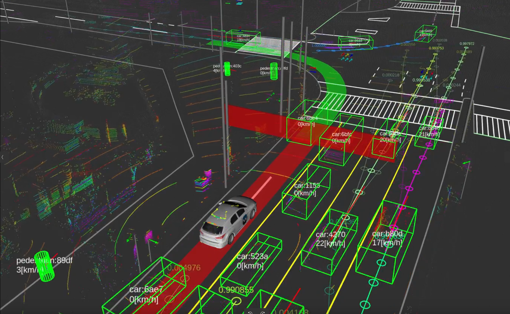

# Autoware Universe

## Welcome to Autoware Universe

Autoware Universe serves as a foundational pillar within the Autoware ecosystem, playing a critical role in enhancing the core functionalities of autonomous driving technologies.
This repository is a pivotal element of the Autoware Core/Universe concept, managing a wide array of packages that significantly extend the capabilities of autonomous vehicles.

## Getting Started

To dive into the vast world of Autoware and understand how Autoware Universe fits into the bigger picture, we recommend starting with the [Autoware Documentation](https://autowarefoundation.github.io/autoware-documentation/). This resource provides a thorough overview of the Autoware ecosystem, guiding you through its components, functionalities, and how to get started with development.

### Explore Autoware Universe documentation

For those looking to explore the specifics of Autoware Universe components, the [Autoware Universe Documentation](https://autowarefoundation.github.io/autoware.universe/), deployed with MKDocs, offers detailed insights.

### Module
- vehicle
  - accel_brake_map_calibrator 加速制动图校准
- sensing
  - gnss_poser 获取gnss
  - imu_corrector 校正imu
  - image_transport_decompressor 图像解压缩
- localization
  - pose_initializer 初始化位姿
- map
  - map_loader 地图加载
- control
  - autonomous_emergency_braking 自动紧急制动
- planning
  - costmap_generator 栅格图生成
  - path_smoother 路径平滑
- perception
  - euclidean_cluster 点云聚类